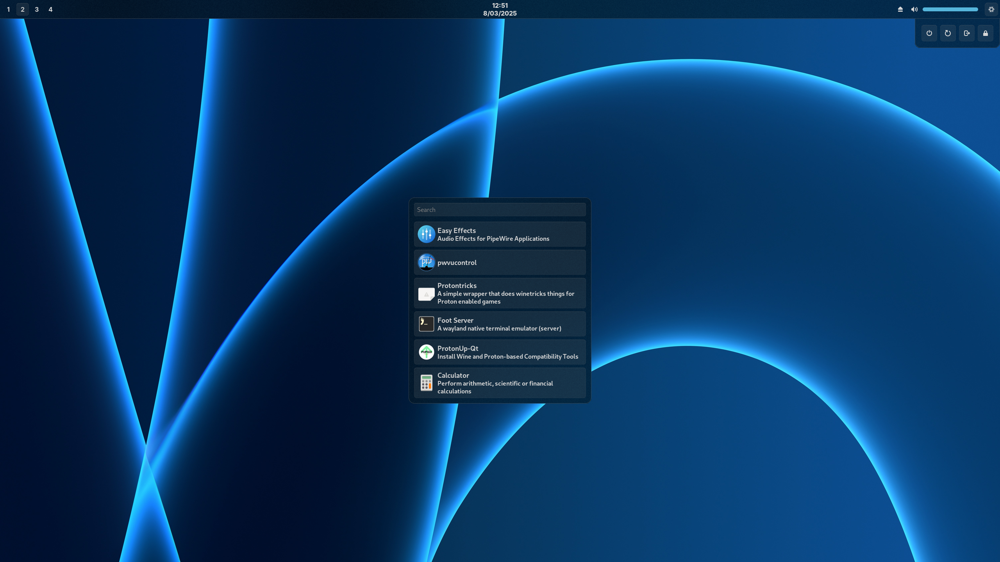

<p align="center">
▄▀█ █▀▀ █▀ ▄▄ ▄▀▀ █▀█ █▄░█ █▀▀ ▀█▀ █▀▀<br>
█▀█ █▄█ ▄█ ░░ ▀▄▄ █▄█ █░▀█ █▀░ ▄█▄ █▄█
</p>

---

<p align="center">
My personal <a href="https://github.com/Aylur/ags">Ags</a>/<a href="https://github.com/aylur/astal">Astal</a> configuration for Hyprland
</p>

<div align="center"></div>

> [!WARNING]
> I do not recommend actually using this in your configuration as I may change and break things at any moment.
>
> You have been warned, have fun !

## Features

<details>
<summary>A top bar</summary>

  - Default keybind to open the power menu is <kbd>$mainMod, m</kbd>

</details>
<details>
<summary>A wallpaper selector</summary>

  - Right now, it only works with [swww](https://github.com/LGFae/swww), making it a requierment.<br>
  I plan to change that.
  - `ffmpegthumbnailer` is also requierd for generating thumbnails.
  - Wallpapers have to be located in<br>
  `~/Pictures/Wallpapers/images`.
  - Only one level of sub-directories is supported.

</details>

## Running
If using Nix, you can simply run the following command to try it without installing
```Shell
nix run github:PierreBorine/ags-config
```

Otherwise, you can download the config and execute it just like any other ags config
```Shell
git clone https://github.com/PierreBorine/ags-config.git
cd ags-config
nix develop # if using Nix
ags run .
```

## Nix Flakes
Add to the inputs
```Nix
ags-config = {
  url = "github:PierreBorine/ags-config";
  inputs.nixpkgs.follows = "nixpkgs";
};
```

### Home Manager module
For convenience, the flake provides a Home Manager module
```Nix
{inputs, ...}: {
  imports = [inputs.ags-config.homeManagerModules.default];

  ags-config = {
    # Also installs `pkgs.ags`
    enable = true;

    hyprland = {
      # true by default
      layerrules = true;
      # false by default
      autoStart = true;
      # false by default
      # If you don't like my binds, copy them
      # from `hm.nix` and edit them to your liking.
      binds = true;
    };
  };
}
```

> [!TIP]
> If you have an [impermanent](https://github.com/nix-community/impermanence) setup, you should persist `$HOME/.cache/astal`.

> [!NOTE]
> Local `vars.ts` is ignored by the Nix bundler. Instead, it uses one generated with Nix.

## Recommended Hyprland rules
Here are my recommended rules for Hyprland
```hyprlang
decoration:blur {
  brightness=0.5
  contrast=0.8
  enabled=true
  noise=0.09
  passes=4
  size=16
  vibrancy=0.8
  vibrancy_darkness=0.8
}

# Included in the Home Manager module
layerrule = blur, ^(astal-)(.*)$
layerrule = ignorezero, ^(astal-)(.*)$
layerrule = animation popin, astal-launcher
layerrule = animation slide right, astal-wallpapers
layerrule = order 1, astal-powerMenu
```

## Other configs I took inspiration and code from
To [matt1432](https://git.nelim.org/matt1432/nixos-configs)<br>
To [gitmeED331](https://github.com/gitmeED331/agsv2)
