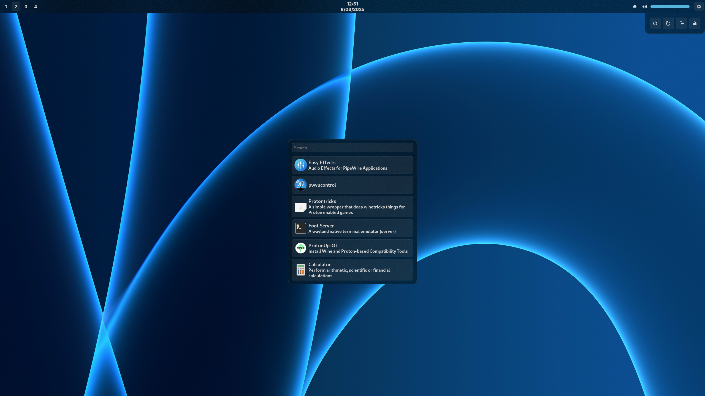

<p align="center">
▄▀█ █▀▀ █▀ ▄▄ ▄▀▀ █▀█ █▄░█ █▀▀ ▀█▀ █▀▀<br>
█▀█ █▄█ ▄█ ░░ ▀▄▄ █▄█ █░▀█ █▀░ ▄█▄ █▄█
</p>

---

<p align="center">
My personal <a href="https://github.com/Aylur/ags">Ags</a>/<a href="https://github.com/aylur/astal">Astal</a>
configuration for Hyprland
</p>

old screenshot:
<div align="center"></div>

> [!WARNING]
> I do not recommend actually using this in your configuration as I may change
> and break things at any moment.
>
> You have been warned, have fun !

## Features

only a basic bar

## Running

If using Nix, you can simply run the following command to try it without installing

```Shell
nix run github:PierreBorine/ags-config
```

Otherwise, you can download the config and execute it just like any other ags config

```Shell
git clone https://github.com/PierreBorine/ags-config.git
cd ags-config
nix develop # if using Nix
ags run .
```

## Nix Flakes

Add to the inputs

```Nix
ags-config = {
  url = "github:PierreBorine/ags-config";
  inputs.nixpkgs.follows = "nixpkgs";
};
```

### Home Manager module

For convenience, the flake provides a Home Manager module

```Nix
{inputs, ...}: {
  imports = [inputs.ags-config.homeModules.default];

  ags-config = {
    # Also installs `pkgs.ags`
    enable = true;

    # false by default
    systemd.enable = true;

    hyprland = {
      # true by default
      layerrules = true;
      # false by default
      autoStart = true;
      # false by default
      # currently does nothing
      binds = true;
    };
  };
}
```

> [!NOTE]
> Local `vars.ts` is ignored by the Nix bundler. Instead, it uses one
> generated with Nix.

## Recommended Hyprland rules

Here are my recommended rules for Hyprland

```hyprlang
decoration:blur {
  brightness=0.5
  contrast=0.8
  enabled=true
  noise=0.09
  passes=4
  size=16
  vibrancy=0.8
  vibrancy_darkness=0.8
}

# Included in the Home Manager module
layerrule = match:namespace ^(astal-)(.*)$, blur on, xray on, ignore_alpha 0
```

## Other configs I took inspiration and code from

- [matt1432](https://git.nelim.org/matt1432/nixos-configs)
- [gitmeED331](https://github.com/gitmeED331/agsv2)
